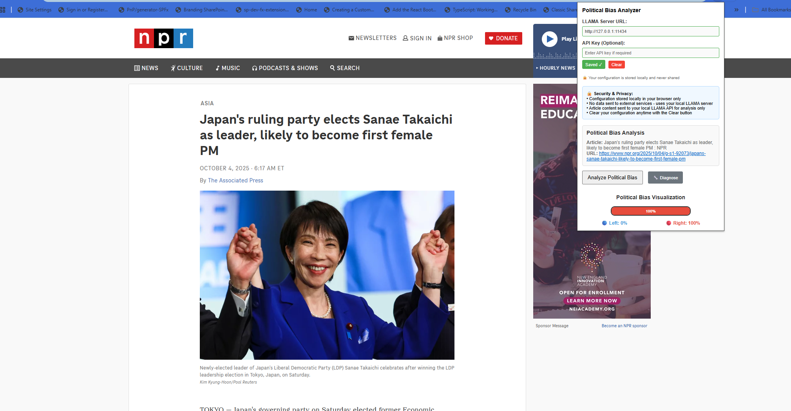

# Political Bias Analyzer - Chrome Extension (LLAMA Edition)

A Chrome extension that analyzes political bias in news articles and web content using a local LLAMA API. The extension extracts article content and provides a visual breakdown of left vs. right political leaning percentages.



## Features

- **Political Bias Analysis**: Analyzes news articles and web content for political bias using local LLAMA AI
- **Visual Charts**: Displays results in an interactive donut chart with left/right percentages
- **Local Processing**: Uses your local LLAMA server - no external API calls or costs
- **Content Extraction**: Automatically extracts article content from various website layouts
- **Privacy Focused**: All data stays on your local machine - complete privacy
- **Fallback Visualization**: Shows text-based charts when Chart.js fails to load
- **Diagnostic Tools**: Built-in connection testing and troubleshooting

## Installation

### Prerequisites
- Chrome browser (or Chromium-based browser)
- Local LLAMA server (recommended: [Ollama](https://ollama.ai/))

### Setup Steps

1. **Install LLAMA Server**
   - **Recommended: Ollama**
     ```bash
     # Download from https://ollama.ai/ or use:
     curl -fsSL https://ollama.ai/install.sh | sh
     ```
   - **Alternative: llama.cpp**
     ```bash
     git clone https://github.com/ggerganov/llama.cpp
     cd llama.cpp
     make
     ```

2. **Configure LLAMA Server**
   
   **For Ollama:**
   ```bash
   # Pull a model
   ollama pull llama3
   
   # Start the server
   ollama serve
   ```
   
   **For Windows Users - Setting Environment Variables:**
   
   If you encounter connection issues, you may need to configure Ollama to allow web origins:
   
   1. **Quit Ollama** by clicking on it in the task bar
   
   2. **Start Settings** (Windows 11) or Control Panel (Windows 10) and search for "environment variables"
   
   3. **Click "Edit environment variables for your account"**
   
   4. **Edit or create new variables** for your user account:
      - `OLLAMA_HOST` (if needed)
      - `OLLAMA_MODELS` (if needed)
      - Other Ollama-specific variables
   
   5. **Click OK/Apply** to save
   
   6. **Start Ollama** from the Windows Start menu
   
   **For more details on configuring web origins, see:** [Ollama FAQ - Allow Additional Web Origins](https://github.com/ollama/ollama/blob/main/docs/faq.md#how-can-i-allow-additional-web-origins-to-access-ollama)

3. **Download the Extension**
   ```bash
   git clone <repository-url>
   cd chromeextension.Ideologicallabeling.LLAMA
   ```

4. **Install in Chrome**
   - Open Chrome and navigate to `chrome://extensions/`
   - Enable "Developer mode" (toggle in top-right corner)
   - Click "Load unpacked"
   - Select the extension folder containing `manifest.json`

5. **Configure Extension**
   - Click the extension icon in your browser toolbar
   - Enter your LLAMA server URL (default: `http://localhost:11434`)
   - Optionally enter an API key if required by your server
   - Click "Save Config" to test and store the configuration

## Usage

1. **Navigate to an Article**: Go to any news article or webpage you want to analyze
2. **Open the Extension**: Click the "Political Bias Analyzer" icon in your browser toolbar
3. **Test Connection** (optional): Click the "🔧 Diagnose" button to test your LLAMA server connection
4. **Analyze Content**: Click the "Analyze Political Bias" button
5. **View Results**: See the political bias breakdown with:
   - Percentage analysis (Left vs. Right leaning)
   - Visual donut chart
   - Article metadata (title, URL)

## How It Works

### Content Extraction
The extension uses a content script (`content.js`) that:
- Scans the webpage for article content using multiple selectors
- Extracts headings (H1-H6) and main text content
- Limits content to 8000 characters for API efficiency
- Handles various website layouts automatically

### AI Analysis
- Sends article content to your local LLAMA server
- Uses a specialized prompt to analyze political bias
- Supports multiple API endpoints (Ollama, llama.cpp, OpenAI-compatible)
- Returns structured percentage breakdown
- Processes results with error handling and validation

### Security Features
- Configuration validation before saving
- Local storage only (no external servers)
- Masked configuration display
- Clear configuration functionality
- Test LLAMA server connectivity before analysis
- Diagnostic tools for troubleshooting

## File Structure

```
chromeextension.Ideologicallabeling.LLAMA/
├── manifest.json                    # Extension configuration
├── popup.js                        # Main popup interface logic
├── PoliticalBiasAnalyzer.html      # Extension popup UI
├── content.js                      # Content script for article extraction
├── background.js                   # Background service worker
├── LLAMA_SETUP.md                 # Detailed LLAMA setup instructions
└── README.md                      # This file
```

## LLAMA Server Requirements

- **Local LLAMA Server**: Required for bias analysis (recommended: Ollama)
- **Model**: Uses `llama3` by default (configurable)
- **No Rate Limits**: Local processing - no external API limits
- **No Cost**: Free local processing after initial setup
- **Hardware**: Requires sufficient RAM and CPU for LLAMA model

## Privacy & Security

- ✅ Configuration stored locally in browser storage only
- ✅ No data sent to external services - uses your local LLAMA server
- ✅ Article content sent to your local LLAMA API for analysis only
- ✅ No personal information collected or stored
- ✅ Complete privacy - all processing happens on your machine
- ✅ Clear configuration functionality for easy removal

## Troubleshooting

### Common Issues

**"Content Script Not Loaded" Error**
- Solution: Refresh the webpage and try again
- This happens when the extension is installed on an already-open page

**"LLAMA API Connection Failed" or "403 Forbidden" Error**
- Ensure your LLAMA server is running: `ollama serve`
- Check server accessibility: `curl http://localhost:11434/api/tags`
- Try restarting Ollama: `ollama stop && ollama serve`
- Verify model is loaded: `ollama list`
- Use the "🔧 Diagnose" button for detailed connection testing

**"No Article Content Found"**
- The page may not have detectable article content
- Try on a different news website or article page

**Chart Not Displaying**
- Extension includes fallback visualization when Chart.js fails
- Check internet connection for CDN loading

**Windows Connection Issues**
- Follow the Windows environment variables setup in the Installation section
- Ensure Ollama is properly configured for web origins
- See: [Ollama FAQ - Allow Additional Web Origins](https://github.com/ollama/ollama/blob/main/docs/faq.md#how-can-i-allow-additional-web-origins-to-access-ollama)

### Configuration Management

- **Save**: Enter server URL and click "Save Config" to validate and store
- **Clear**: Click "Clear" button to remove stored configuration
- **Update**: Modify the URL field and click "Save Config" again
- **Diagnose**: Use the "🔧 Diagnose" button to test connection and troubleshoot

## Development

### Local Development

1. Make changes to source files
2. Go to `chrome://extensions/`
3. Click the refresh icon on the extension card
4. Test changes in the extension popup

### Key Files to Modify

- `popup.js`: Main functionality and UI logic
- `content.js`: Article content extraction logic
- `PoliticalBiasAnalyzer.html`: Extension popup interface
- `manifest.json`: Extension permissions and configuration

### Testing

- Test on various news websites
- Verify LLAMA server connection works
- Check error handling for different scenarios
- Ensure chart rendering works properly
- Test diagnostic tools functionality

## Contributing

1. Fork the repository
2. Create a feature branch
3. Make your changes
4. Test thoroughly
5. Submit a pull request

## License

This project is open source. Please ensure you comply with the LLAMA model's usage policies when using local LLAMA servers.

## Disclaimer

This tool is for educational and informational purposes only. Political bias analysis is inherently subjective and should not be the sole basis for decision-making. The AI analysis reflects patterns in the training data and may not capture all nuances of political content.
